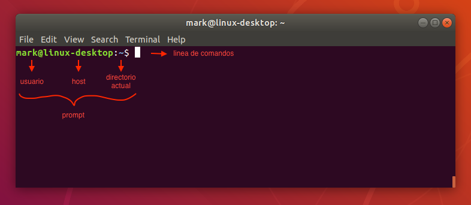
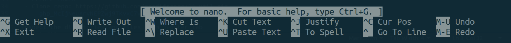

# Uso de la línea de comandos o shell

El shell (o línea de comandos) es un lenguanje de comandos interactivos y un lengujae de programación. Es usado por el sistema operativo para controlar la ejecución del sistema usando scripts de shell y también es útil para automatizar una variedad de tareas.

Es usado principalmente en sistemas operativos basados en Linux y Unix (como MacOS), existen distintos shells pero los más comunes son *bash*, *zsh* y *PowerShell*

- bash: shell predeterminado de Linux
- zsh: shell predeterminado de MacOS
- PowerShell: shell de Windows

Puedes acceder a la línea de comandos dando clic en la aplicación de 'Terminal' en Linux y MacOS o bien en la aplicación de 'PowerShell' en Windows. Al abrirlo, verás algo similar a esto:



En este caso `mark@linux-desktop:~ $` es lo que se conoce como *prompt*, `mark` corresponde al nombre de usuario y `linux-desktop` al nombre del host. Los shells son lenguajes basados en comandos y suelen tener la siguiente sintaxis:

```
$ command [-options] [arguments]
```

en donde los paréntesis cuadrados indican que la sección es opcional, por ejemplo en `rm -rf temp-dir/` el comando principal es `rm` (remove) y está siendo usado con las opciones `r` (recursive) y `f` (force), siendo el argumento el nombre de la carpeta que queremos eliminar de manera recursiva y forzada `temp-dir/`.

También puedes acceder a la documentación con el comando `man` (manual) de la siguiente manera:

```
$ man command
```

por ejemplo, para obtener la documentación del comando `ls`, se puede usar `man ls`. Para navegar por la página usa las flechas hacia arriba y abajo o la barra espaciadora, para salir de la pagina de documentación usa la tecla `q` (quit).


## Movimientos básicos

Los siguientes comandos pueden ser usados para moverte a través de tus directorios

| Comando | Descripción |
| --- | --- |
| pwd | print working directory |
| ls | list directory |
| cd | change directory |
| cp | copy file or directory |
| mv | move/rename file or directory |
| rm | remove file |
| rmdir | remove (empty) directory |
| mkdir | make directory |


## Caracteres especiales

Los siguientes caracteres especiales son de mucha ayuda cuando navegamos entre directorios; prueba usando el comando `cd` con el caracter especial `~` que indica el "home directory", *i.e.* usa el comando `cd ~` para cambiar a tu directorio principal.

| Caracter especial | Descripción |
| --- | --- |
| ~ | home directory |
| . | current directory |
| .. | parent directory |
| - | previous directory |


## Manipulación de archivos

| Comando | Descripción |
| --- | --- |
| cat | imprime todo el contenido de un archivo |
| less/more | accede al contenido de un archivo por partes. Para navegar por la página usa las flechas hacia arriba y abajo o la barra espaciadora, para salir de la pagina de documentación usa la tecla `q` (quit). |
| head | imprime las 10 primeras líneas de un archivo |
| tail | imprime las 10 últimas líneas de un archivo |
| diff | compara las diferencias entre dos archivos |


### Editores de texto (nano)

Existen una amplia variedad de editores de texto desde la terminal, sin embargo `nano` es el editor más sencillo. Nano te permite crear y editar archivos de texto (.py, .jl, .md, .txt, .csv, etc). Para acceder a él utiliza el comando `nano` y el nombre del archivo que quieres crear o editar

```
$ nano filename.txt
```

El archivo se abrirá y podrás empezar a escribir. Nano se comunica con el usuario mostrando mensajes en la parte inferior de la ventana, al inicio puedes encontrar un mensaje de bienvenida y una lista de atajos (observa que los atajos son sensibles a mayúsculas y minúsculas).



Los atajos más importantes son aquellos para guardar y salir del archivo.

- Save: Ctrl-o + Enter
- Exit: Ctrl-x

Si tratas de salir sin guardar los cambios aparecerá un mensaje en la parte inferior preguntando si quieres guardar antes de salir, escribe la letra `y` para 'yes', `n` para 'no' o `Ctrl-C` para cancelar.


## Ejemplos

Imaginemos que tenemos la siguiente estructura de archivos en nuestro home directory:

```
~
├── Documents/
│   ├── books/
│   │   ├── asdasdasd.pdf
│   │   └── asdasdas.pdf
│   └── files/
│       └── asdasdas.txt
└── Downloads/
```

- `ls`
    - `ls -lt` - formato de lista larga ordenado por última modificación
    - `ls -la` - formato de lista larga incluyendo archivos ocultos
    - `ls Documents` - enlista el contenido de la carpeta `Documents`
    - `ls Documents/books` - enlista el contenido de la carpeta `books` contenida en `Documents`
- `cd`
    - `cd Documents` - cambia a la carpeta `documents`
    - `cd Documents/books` - cambia a la carpeta `books` contenida en `Documents`
    - `cd ~` - cambia al home directory
    - `cd ..` - cambia al parent directory (e.g. si la carpeta actual es `books`, debería cambiar a `Documents`)
- `cp`
    - `cp books files` - copia la carpeta `books` en la carpeta `files`

## Recursos complementarios

- [Command Line Crash Course](https://learnpythonthehardway.org/book/appendixa.html). Appendix A of Learn Python the Hard Way by 
- (The Missing Semester of Your CS Education)[https://missing.csail.mit.edu/]. MIT course
- Miell, Ian. Learn Bash the Hard Way.
